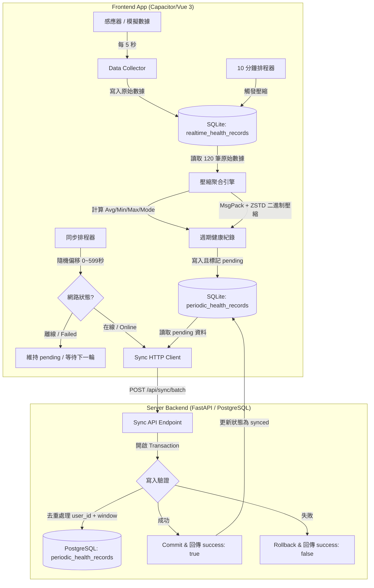

# HealthSync Alert: 本地與後端資料同步實作計畫 (Alan's Plan)

本文件定義 HealthSync Alert 專案中，**本地前端資料蒐集**與**本地後端資料同步**的完整實作計畫。

---

## 1. 核心目標

根據專案進度規劃，同步功能的兩大核心指標為：
1. **5 秒高頻蒐集**：前端 App 每 5 秒從感應器（或模擬引擎）採樣一次即時健康數據，寫入本地 SQLite 資料庫。
2. **10 分鐘打包壓縮與上傳**：本地端每 10 分鐘將這 10 分鐘內產生的高頻原始數據進行統計壓縮，轉換為週期健康紀錄，並在有網路的情況下自動上傳至伺服器。

---

## 2. 系統架構圖 (Mermaid)

以下為資料流從前端採樣、本地儲存、壓縮打包到伺服器同步的完整生命週期：



---

## 3. 資料庫結構設計 (Database Schema)

### 3.1 本地端 SQLite 設計

#### A. 原始即時健康資料表 (已存在)
*   **資料表名稱**：`realtime_health_records`
*   **用途**：保存高頻的 5 秒即時感應器數據（保留 7 天）。

| 欄位名稱 | 資料類型 | 限制 | 說明 |
| :--- | :--- | :--- | :--- |
| `id` | TEXT | PRIMARY KEY | 唯一識別碼 (UUID) |
| `heart_rate` | INTEGER | NOT NULL | 心率 (bpm) |
| `hrv` | INTEGER | NOT NULL | 心率變異異性 (ms) |
| `sp_o2` | REAL | NOT NULL | 血氧飽和度 (%) |
| `activity_level` | INTEGER | NOT NULL | 活動等級 (0: 靜止, 1: 低, 2: 中, 3: 高) |
| `recorded_at` | TEXT | NOT NULL | 採樣時間 (ISO 8601) |

#### B. 週期健康紀錄表 (需新建)
*   **資料表名稱**：`periodic_health_records`
*   **用途**：保存 10 分鐘打包壓縮後的統計結果，作為同步的輸出源。

| 欄位名稱 | 資料類型 | 限制 | 說明 |
| :--- | :--- | :--- | :--- |
| `id` | TEXT | PRIMARY KEY | 唯一識別碼 (UUID) |
| `window_start` | TEXT | NOT NULL | 壓縮視窗起始時間 (ISO 8601) |
| `window_end` | TEXT | NOT NULL | 壓縮視窗結束時間 (ISO 8601) |
| `avg_hr` | INTEGER | NOT NULL | 平均心率 |
| `min_hr` | INTEGER | NOT NULL | 最低心率 |
| `max_hr` | INTEGER | NOT NULL | 最高心率 |
| `avg_hrv` | INTEGER | NOT NULL | 平均 HRV（HRV 本身為統計離散度指標 RMSSD，僅取平均值） |
| `avg_spo2` | REAL | NOT NULL | 平均血氧 |
| `min_spo2` | REAL | NOT NULL | 最低血氧 |
| `dominant_activity_level` | INTEGER | NOT NULL | 最主要的活動等級 (眾數 Mode) |
| `sample_count` | INTEGER | NOT NULL | 該視窗內實際採樣的樣本數 |
| `sync_status` | TEXT | DEFAULT 'pending' | 同步狀態: `'pending'` (待同步) / `'synced'` (已同步) |
| `raw_data_payload` | BLOB | NULL | 原始高頻 5s 數據 (採用 MessagePack + ZSTD 壓縮之二進制數據，完全避開 JSON 儲存) |
| `created_at` | TEXT | NOT NULL | 本紀錄建立時間 (ISO 8601) |

---

### 3.2 伺服器端 PostgreSQL 設計

*   **資料表名稱**：`periodic_health_records`
*   **用途**：保存各裝置上傳的長期週期健康紀錄。

| 欄位名稱 | 資料類型 | 限制 | 說明 |
| :--- | :--- | :--- | :--- |
| `id` | SERIAL / BIGSERIAL | PRIMARY KEY | 伺服器端自增主鍵 |
| `user_id` | VARCHAR(50) | NOT NULL, INDEX | 所屬使用者 ID |
| `device_id` | VARCHAR(100) | NOT NULL | 來源裝置 ID |
| `window_start` | TIMESTAMPTZ | NOT NULL | 視窗起始時間 |
| `window_end` | TIMESTAMPTZ | NOT NULL | 視窗結束時間 |
| `avg_hr` | INTEGER | NOT NULL | 平均心率 |
| `min_hr` | INTEGER | NOT NULL | 最低心率 |
| `max_hr` | INTEGER | NOT NULL | 最高心率 |
| `avg_hrv` | INTEGER | NOT NULL | 平均 HRV |
| `avg_spo2` | NUMERIC(5,2) | NOT NULL | 平均血氧 |
| `min_spo2` | NUMERIC(5,2) | NOT NULL | 最低血氧 |
| `dominant_activity_level` | INTEGER | NOT NULL | 最主要活動等級 |
| `sample_count` | INTEGER | NOT NULL | 實際樣本數 |
| `raw_data_payload` | BYTEA | NULL | 原始高頻 5s 數據 (採用 MessagePack + ZSTD 壓縮之二進制數據，完全避開 JSON 儲存) |
| `created_at` | TIMESTAMPTZ | server_default=now() | 伺服器寫入時間 |

> [!IMPORTANT]
> **唯一約束 (Unique Constraint)**：伺服器表必須建立 `UNIQUE(user_id, window_start, window_end)` 的複合唯一索引，以確保重複同步重試時，資料不會重複入庫（實現冪等性/Idempotency）。

### 3.3 原始高頻資料同步設計：僅上傳統計資料 vs. 二進制極致打包 (MessagePack + ZSTD)

在設計「10 分鐘打包壓縮」時，對於 **5 秒高頻原始資料** 是否要同步到伺服器，有以下兩種方案，**本計畫採用方案 C 作為最終決策**：

#### 方案 A：僅同步統計資料 (Summary-only Sync)
*   **做法**：本地端保留 5 秒原始資料（保留 7 天以供即時分析與本地圖表顯示）。每 10 分鐘只計算出統計特徵（`avg_hr`、`min_hr`、`max_hr` 等）並上傳。
*   **優點**：極度節省網路流量與伺服器儲存空間。伺服器庫非常輕量。
*   **缺點**：伺服器端無法復原 5 秒等級的歷史健康波動曲線。
*   **`raw_data_payload` 欄位行為**：本地 SQLite 寫入 `NULL`，HTTP Payload 中省略此欄位。

#### 方案 C（最終決策）：統計資料 + MessagePack + ZSTD 二進制極致打包 (Ultimate Binary Sync)
*   **做法**：這是工業級最頂尖的設計！將這 10 分鐘內的 120 筆二維數值陣列 `[[相對秒數, heart_rate, hrv, sp_o2, activity_level], ...]`，先使用 **MessagePack** 序列化為二進制位元組流（Uint8Array），再使用 **Zstandard (ZSTD)** 壓縮演算法壓到極致後上傳。**完全不經過任何 JSON 格式，達到空間與頻寬的最大節省！**
*   **技術說明**：
    *   **MessagePack (MsgPack)**：就是你所說的「跟 JSON 很像但完全不相容且超省空間」的二進制格式！它的標語是 *"It's like JSON. but fast and small"*。它免去了 JSON 的引號、括號與逗號，並利用可變長度編碼儲存整數。
    *   **ZSTD**：由 Facebook 開發的即時無損壓縮演算法。由於感應器數據（心率、血氧）在 10 分鐘內通常呈現高度連續性與相似性，ZSTD 的字典壓縮與重複性消除能力極強。
*   **套件選用**：
    *   **前端 (Vite/TS)**：`@msgpack/msgpack` (輕量零依賴) + `zstd-codec` (基於 WebAssembly 的 ZSTD 實作，同時支援壓縮與解壓縮)。
    *   **後端 (Python)**：直接用 `msgpack` + `zstandard` 標準庫。

> [!WARNING]
> 注意：`fzstd` 套件**僅支援解壓縮**，不支援壓縮。前端需要壓縮功能，因此必須使用 `zstd-codec`（WASM 實作，壓縮/解壓縮皆可）。
*   **數據壓縮比對 (120筆 5秒數據)**：
    *   原始冗長 JSON：**~15 KB**
    *   緊湊二維 JSON：**~2.5 KB**
    *   MessagePack 二進制：**~800 Bytes**
    *   **MessagePack + ZSTD**：**僅約 200 ~ 250 Bytes**！(比原始 JSON 節省了 **98.6%** 的空間！)
*   **資料表欄位擴充**：
    *   **SQLite (`periodic_health_records`)**：新增 `raw_data_payload BLOB NULL` 欄位。
    *   **PostgreSQL (`periodic_health_records`)**：新增 `raw_data_payload BYTEA NULL` 欄位（儲存二進制數據流）。

> [!TIP]
> **決策結論：採用方案 C**！它以難以置信的 **200 Bytes** 體積極致保存了 5 秒高頻的所有健康細節，對手機流量、電池壽命及伺服器資料庫儲存都是最完美的解法！

---

## 4. 前端詳細實作流程 (Mobile Client)

### 4.1 5 秒高頻感應器數據蒐集
*   **現狀**：已在 `mobile-app/src/modules/health-simulation/engine/schedule.ts` 中透過 `setInterval` (5000ms) 啟動，將生成的 `RawHealthRecord` 寫入 SQLite。
*   **強化點**：
    *   確保當應用程式在背景（Background）執行時，排程不會被系統輕易砍掉（後續可考慮使用 Capacitor Background Task 插件）。
    *   確認 `sqlite.ts` 在初始化時會執行建立相關資料表。

### 4.2 10 分鐘打包壓縮引擎 (Aggregator)
建立排程每 10 分鐘執行一次打包：
1.  **時間視窗定義**：採用固定的 10 分鐘對齊（例如：若當前時間為 10:15:30，壓縮視窗為 `10:00:00` ~ `10:09:59`）。
2.  **壓縮計算公式**：
    *   `avg_hr` = $\text{round}(\frac{\sum \text{heart\_rate}}{N})$
    *   `min_hr` = $\min(\text{heart\_rate})$
    *   `max_hr` = $\max(\text{heart\_rate})$
    *   `avg_hrv` = $\text{round}(\frac{\sum \text{hrv}}{N})$（HRV 本身為統計離散度指標 RMSSD，對其再取 min/max 醫學意義較低，故僅取平均）
    *   `avg_spo2` = $\text{round}(\frac{\sum \text{sp\_o2}}{N}, 2)$
    *   `min_spo2` = $\min(\text{sp\_o2})$
    *   `dominant_activity_level` = 視窗內出現次數最多的 `activity_level`（眾數）。
    *   `sample_count` = 本視窗讀取到的總筆數。
3.  **二進制打包 (方案 C 專屬)**：
    *   將視窗內的原始資料轉換為二維陣列：`[[offset_sec, hr, hrv, spo2, act], ...]`
    *   調用 `@msgpack/msgpack` 序列化。
    *   調用 `zstd-codec` 壓縮為最終二進制流 (Uint8Array)，寫入 SQLite 的 `raw_data_payload` BLOB 欄位。
4.  **邊界值與例外處理 (依據 sync-design.md)**：
    *   **不完整視窗處理**：若該視窗內的樣本數不足 6 筆（如中途關機或 App 重啟），不立即生成紀錄，而是標記為不完整。
    *   **啟動補壓縮機制**：當 App 啟動時，自動掃描上一次中斷遺留的未壓縮區間，往後合併最多 2 個視窗。若合併後樣本數 $\ge 6$ 筆則壓縮，不足 6 筆則捨棄最舊視窗。

### 4.3 隨機偏移與同步觸發 (Sync Client)
1.  **隨機偏移 (Jitter)**：壓縮完成後，計算一個 `0 ~ 599 秒` 的隨機延遲，時間到了才發送網路請求，藉此分散伺服器的連線尖峰。
2.  **連線檢測**：利用 `@capacitor/network`，在準備發送的當下檢查連線狀態，唯有當網路狀態為 `online` 時才實際上傳。
3.  **批次上傳與更新**：
    *   讀取所有本地 SQLite 中 `sync_status = 'pending'` 的週期健康紀錄。
    *   將每筆紀錄的 `raw_data_payload` BLOB 欄位讀取為 `Uint8Array`，並轉換為 **Base64 字串** 後放入 JSON payload 的對應欄位。
    *   調用 API `POST /api/sync/batch`。
    *   若伺服器回傳 `success = true`，使用 SQL `UPDATE periodic_health_records SET sync_status = 'synced' WHERE id IN (...)` 更新狀態。

> [!NOTE]
> **預警資料同步 (`alerts`) 已於階段四完成**：預警資料的本地正規化與伺服器冪等同步流程已在伺服器資料保存階段一併實作完成，完整定義請見 [伺服器資料保存計畫.md](./伺服器資料保存計畫.md)。

---

## 5. 後端詳細實作流程 (Server Backend)

### 5.1 API 定義：`POST /api/sync/batch`

#### Request Payload Schema (Pydantic)
```json
{
  "user_id": "user_123",
  "device_id": "device_pixel7_001",
  "sync_started_at": "2026-05-17T12:10:00+08:00",
  "periodic_health_records": [
    {
      "window_start": "2026-05-17T12:00:00+08:00",
      "window_end": "2026-05-17T12:09:59+08:00",
      "avg_hr": 78,
      "min_hr": 65,
      "max_hr": 92,
      "avg_hrv": 52,
      "avg_spo2": 98.4,
      "min_spo2": 96.0,
      "dominant_activity_level": 1,
      "sample_count": 120,
      "raw_data_payload": "KLUv/QBYbQEA..." 
    }
  ],
  "alerts": []
}
```

> [!NOTE]
> `raw_data_payload` 欄位為 Base64 字串，內容為 120 筆 5 秒原始數據經 MessagePack + ZSTD 壓縮後的二進制轉 Base64。後端接收後 Base64 解碼，直接以 BYTEA 存入 PostgreSQL。若採方案 A（僅統計），此欄位省略不傳。

#### Response Schema
```json
{
  "success": true,
  "accepted_health_record_count": 1,
  "accepted_alert_count": 0,
  "server_received_at": "2026-05-17T12:11:05+08:00"
}
```

### 5.2 交易 (Transaction) 與冪等寫入邏輯
1.  **資料庫交易 (Atomic Tx)**：整批同步必須在同一個資料庫交易中完成。任何一筆資料寫入失敗，均自動進行 `rollback`，確保不會產生部分成功、部分失敗的複雜對帳狀態。
2.  **冪等插入 (Upsert / Do Nothing)**：
    *   使用 SQLAlchemy 的 PostgreSQL 專屬擴充 `insert(PeriodicHealthRecord).on_conflict_do_nothing(index_elements=['user_id', 'window_start', 'window_end'])`。
    *   即使前端因為同步逾時未收到 Response 而重傳同一批資料，後端也能安全略過重複的視窗，且不會拋出 Duplicate Key 異常。

---

## 6. 具體開發任務清單與實作步驟

為了確保實作的精準與穩健，我們將開發工作拆解為以下四個階段：

### 階段一：後端資料表與 API 實作
- [x] **後端環境配置**：安裝 `msgpack` 與 `zstandard` 套件。
- [x] **後端資料庫模型**：在 `server/app/models/periodic_health_record.py` 新建 SQLAlchemy 週期健康紀錄模型。
- [x] **資料庫模型匯入**：在 `server/app/core/database.py` 的 `create_db_tables` 內匯入新模型以自動建表。
- [x] **後端 Pydantic Schema**：定義 Request/Response 的驗證 Schema（包含 Base64 `raw_data_payload`）。
- [x] **批次同步 API**：在 `server/app/api/sync.py` 實作 `POST /sync/batch` 路由、Base64 解碼與寫入 `BYTEA` 邏輯、交易控制與 `on_conflict_do_nothing`，並掛載至 `server/app/main.py`。

### 階段二：前端資料表與壓縮排程器實作
- [x] **前端環境配置**：安裝 `@msgpack/msgpack` 與 `zstd-codec` 套件。
- [x] **前端資料表建置**：在 `mobile-app/src/db/sqlite.ts` 新增 `CREATE_PERIODIC_HEALTH_RECORDS_TABLE_SQL` 語句。
- [x] **壓縮引擎開發**：建立 `mobile-app/src/modules/health-simulation/engine/packer.ts`，實作數學聚合以及 MsgPack+ZSTD 二進制壓縮邏輯。
- [x] **排程觸發器**：在前端建立一個 10 分鐘定期觸發打包壓縮的 Scheduler。
- [x] **異常修補機制**：實作 Boot-up 未完整視窗掃描與向後合併處理。

### 階段三：前端同步機制與網路對接
- [x] **同步客戶端 (SyncClient)**：建立 API 連線封裝，支援讀取 `pending` 資料並發送。
- [x] **隨機偏移與連線監聽**：實作 `0 ~ 599 秒` 的隨機 Delay，並調用 `@capacitor/network` 以便在離線時自動暫緩同步。
- [x] **本地狀態更新**：在同步成功後更新本地 SQLite 紀錄為 `synced`。

### 階段四：端到端 (E2E) 測試與驗證
- [x] **正常路徑驗證**：運行模擬器，觀察 5 秒產生一次資料，10 分鐘成功打包並上傳至 FastAPI 後端。
- [x] **斷網恢復測試**：在同步時切換網路為離線，驗證狀態維持 `pending`，並在重新連線後下一週期補傳。
- [x] **冪等性測試**：模擬網路逾時導致的重傳，驗證 PostgreSQL 不會重複入庫。

---

## 7. 驗證與測試計畫

### A. 自動化測試
*   **單元測試 (Unit Test)**：針對前端打包壓縮的數學運算（`avg`、`min`、`max`、眾數 `mode`）進行測試，確保其對於極端值、空值、不完整視窗的計算結果百分之百精確。
*   **API 測試 (FastAPI Endpoint)**：利用 Python `pytest` 加上 `httpx`，對 `/api/sync/batch` 發送模擬 payload，測試重複視窗的去重寫入。

### B. 手動與模擬測試
*   **斷電/關閉 App 測試**：在 10 分鐘的第 5 分鐘時強制關閉 App，重新開啟後，驗證 App 能否正確追溯並合併上一窗的殘留資料。
*   **大量資料同步效能測試**：在本地手動產生 7 天的 pending 數據，執行同步，驗證網路 payload 的傳輸耗時，以及資料庫寫入 transaction 的穩定度。
